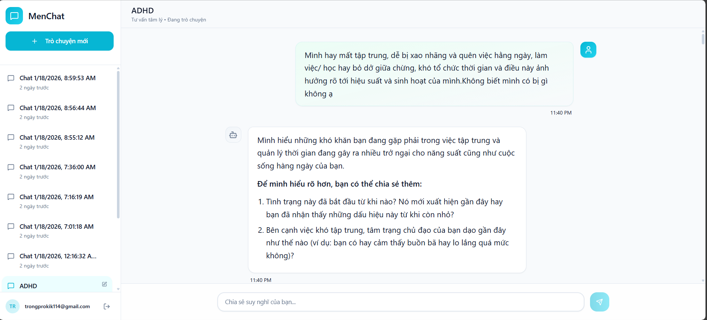
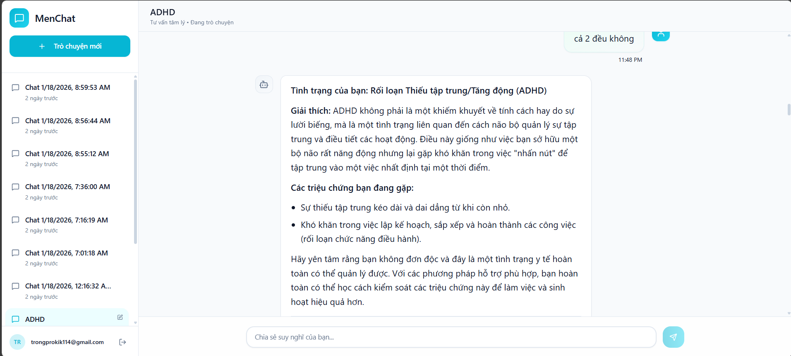
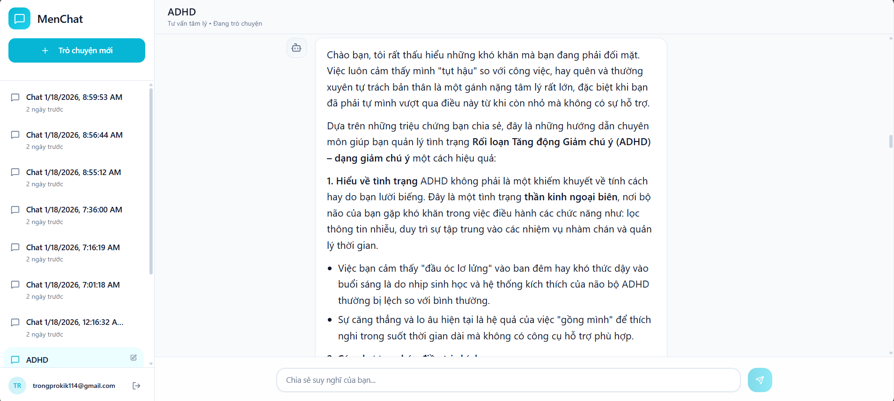
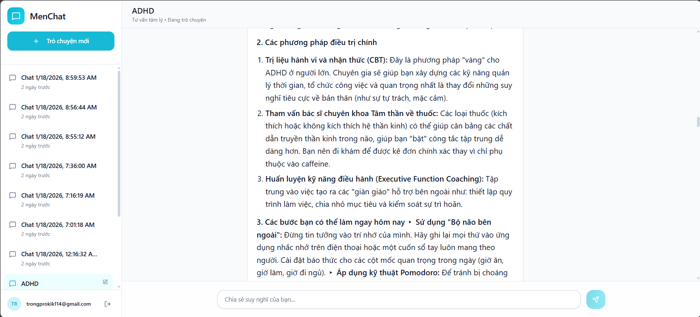
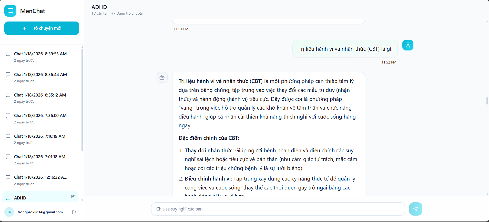
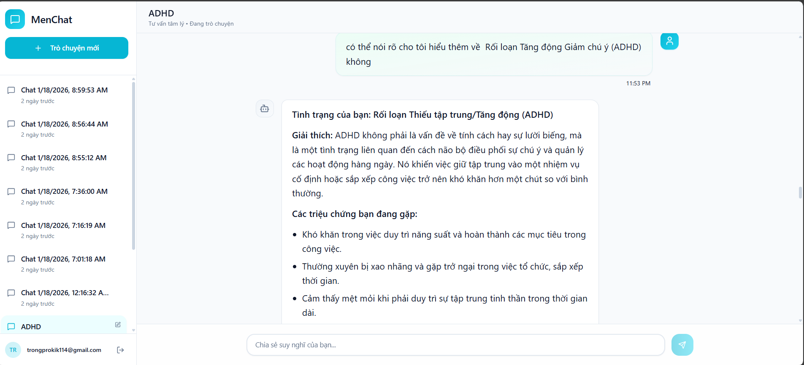

# 🧠 Mental Health Hybrid RAG System

A sophisticated mental health chatbot powered by Hybrid RAG (Retrieval-Augmented Generation) combining Knowledge Graphs, Vector Search, and Advanced LLMs.

## 📋 Table of Contents

- [Overview](#overview)
- [Demo & Screenshots](#demo--screenshots)
- [Key Features](#key-features)
- [Architecture](#architecture)
- [Tech Stack](#tech-stack)
- [Prerequisites](#prerequisites)
- [Installation](#installation)
- [Configuration](#configuration)
- [Usage](#usage)
- [Project Structure](#project-structure)
- [API Documentation](#api-documentation)
- [Development](#development)
- [Contributing](#contributing)
- [License](#license)

## 🌟 Overview

This Mental Health Chatbot system leverages a **Hybrid RAG architecture** that combines:
- **Knowledge Graph (Neo4j)**: Structured medical knowledge with relationships
- **Vector Database (Milvus)**: Semantic search over embeddings
- **LangGraph Workflow**: Orchestrated multi-step reasoning with 4 specialized agents
- **Advanced LLMs**: Google Gemini for natural conversations
- **Reranking**: Cohere reranker for improved retrieval accuracy

The system provides empathetic, evidence-based mental health support through intelligent information retrieval and generation.

### 🤖 Four Specialized Agents

The system employs **4 distinct specialized agents** to handle different types of mental health queries:

1. **🎓 Theoretical Agent**: Provides educational information, explanations of mental health concepts, disorders, and general knowledge
2. **💊 Treatment Agent**: Offers evidence-based treatment guidance, therapy options, and intervention strategies
3. **🔍 Diagnostic Agent**: Assists with symptom assessment, diagnostic support, and identifying potential mental health conditions
4. **😌 Normal Stress/Adjustment Agent**: Handles everyday stress, coping strategies, and normal life adjustments

## 🖼️ Demo & Screenshots

### Conversation Demo

*User asks initial question about a mental health condition*


*🔍 Diagnostic Agent provides symptom assessment and diagnostic support*


*💊 Treatment Agent offers evidence-based treatment guidance and therapy recommendations*


*💊 Treatment Agent continues with detailed intervention strategies*


*🎓 Theoretical Agent provides educational information and concept explanations*


*🎓 Theoretical Agent elaborates on mental health concepts and general knowledge*

> Complete conversation flow demonstrating intelligent agent routing: from initial query through diagnostic assessment (🔍), treatment recommendations (💊), to educational content (🎓)

## ✨ Key Features

### 🔍 **Hybrid RAG Architecture**
- Combines structured graph knowledge with semantic vector search
- Multi-stage retrieval: Dense retrieval → Sparse retrieval → Graph traversal
- Context-aware reranking using Cohere

### 🧠 **Advanced AI Capabilities**
- **LangGraph Workflow**: State management and multi-turn conversations with intelligent routing
- **4 Specialized Agents**: 
  - **Theoretical Agent**: Knowledge base retrieval for educational content
  - **Treatment Agent**: Clinical treatment guidelines and therapy recommendations
  - **Diagnostic Agent**: Symptom-based diagnostic support and assessment
  - **Normal Stress Agent**: Coping strategies for everyday stress and adjustment
- **E5 Large v2 Embeddings**: High-quality semantic representations (1024-dim)
- **Gemini LLM**: Natural, empathetic conversation generation
- **PostgreSQL Checkpointer**: Persistent conversation state across sessions
- **Crisis Detection**: Safety monitoring and immediate intervention routing

### 💬 **User Experience**
- Real-time streaming responses
- Conversation history management
- Authentication & user management
- Clean, responsive React UI with Tailwind CSS

### 🔒 **Security & Reliability**
- JWT-based authentication
- Environment-based configuration
- Docker containerization
- CORS protection
- Rate limiting support

## 🏗️ Architecture

```
┌─────────────┐
│   User UI   │
│  (React)    │
└──────┬──────┘
       │
       ▼
┌────────────────────────────────────────────────────┐
│              FastAPI Backend                        │
│  ┌──────────────────────────────────────────────┐  │
│  │          LangGraph Workflow                  │  │
│  │  ┌────────────────────────────────────────┐  │  │
│  │  │  Query Classifier & Router             │  │  │
│  │  │  ├─ Safety Check (Crisis Detection)    │  │  │
│  │  │  ├─ Query Type Classification          │  │  │
│  │  │  └─ Agent Router                       │  │  │
│  │  └────────────────────────────────────────┘  │  │
│  │                    ↓                          │  │
│  │  ┌─────────────────────────────────────┐     │  │
│  │  │    4 Specialized Agents              │     │  │
│  │  │  🎓 Theoretical    💊 Treatment      │     │  │
│  │  │  🔍 Diagnostic     😌 Normal Stress  │     │  │
│  │  └─────────────────────────────────────┘     │  │
│  │                    ↓                          │  │
│  │  ┌────────────────────────────────────────┐  │  │
│  │  │  Retrieval Pipeline                    │  │  │
│  │  │  ├─ Dense Retrieval (Milvus)          │  │  │
│  │  │  ├─ Graph Traversal (Neo4j)           │  │  │
│  │  │  ├─ Reranking (Cohere)                │  │  │
│  │  │  └─ Response Generation (Gemini)      │  │  │
│  │  └────────────────────────────────────────┘  │  │
│  └──────────────────────────────────────────────┘  │
└────────────────────────────────────────────────────┘
       │         │         │
       ▼         ▼         ▼
   ┌──────┐  ┌──────┐  ┌──────────┐
   │Milvus│  │Neo4j │  │PostgreSQL│
   │Vector│  │Graph │  │ State DB │
   └──────┘  └──────┘  └──────────┘
```

## 🛠️ Tech Stack

### Backend
- **Framework**: FastAPI (Python 3.11+)
- **AI/ML**:
  - LangChain & LangGraph
  - Google Gemini API
  - E5 Large v2 Embeddings
  - Cohere Reranker
  - PyTorch & Transformers
- **Databases**:
  - PostgreSQL (User data, conversations, state)
  - Neo4j (Knowledge Graph)
  - Milvus (Vector Search)

### Frontend
- **Framework**: React 19 + TypeScript
- **Build Tool**: Vite
- **UI Library**: Radix UI + Tailwind CSS
- **HTTP Client**: Axios
- **Markdown**: react-markdown

### Infrastructure
- **Containerization**: Docker & Docker Compose
- **Web Server**: Nginx (reverse proxy)
- **Storage**: MinIO (object storage for Milvus)

## 📦 Prerequisites

- Docker Engine 20.10+
- Docker Compose 2.0+
- 8GB+ RAM (recommended)
- CUDA-capable GPU (optional, for local embeddings)

### API Keys Required
- Google Gemini API key
- Cohere API key (for reranking)
- Milvus Cloud URI & Token (or use local standalone)

## 🚀 Installation

### 1. Clone the Repository

```bash
git clone https://github.com/ToRong31/MentalHealth_HybridRAG.git
cd MentalHealth_HybridRAG
```

> **Note**: The system includes 4 specialized agents with pre-processed knowledge bases for:
> - 🎓 Theoretical knowledge (educational content)
> - 💊 Treatment guidance (clinical protocols)
> - 🔍 Diagnostic support (symptom assessment)
> - 😌 Normal stress coping (everyday strategies)

### 2. Environment Configuration

Create `.env` file in the `backend/src/` directory:

```bash
# Database Configuration
DB_HOST=postgres
DB_PORT=5432
DB_USER=postgres
DB_PASSWORD=postgres123
DB_NAME=mental_health_db

# Neo4j Configuration
NEO4J_URI=bolt://neo4j:7687
NEO4J_USER=neo4j
NEO4J_PASSWORD=kguser2005

# Milvus Configuration
MILVUS_URI=your_milvus_uri
MILVUS_TOKEN=your_milvus_token
MILVUS_DB=default
MILVUS_COLLECTION=kg_entities

# E5 Embedding Model
E5_MODEL_NAME=intfloat/e5-large-v2
E5_DEVICE=cuda  # or 'cpu'

# Google Gemini API
GEMINI_API_KEY=your_gemini_api_key
GEMINI_MODEL=gemini-2.0-flash-exp

# Cohere Reranker
COHERE_API_KEY=your_cohere_api_key

# Security
SECRET_KEY=your_secret_key_here
ACCESS_TOKEN_EXPIRE_MINUTES=30

# CORS
BACKEND_CORS_ORIGINS=["http://localhost:3000","http://localhost:5173"]
```

### 3. Build and Run with Docker

#### Production Mode
```bash
docker-compose up -d
```

#### Development Mode
```bash
docker-compose -f docker-compose-dev.yml up -d
```

### 4. Access the Application

- **Frontend**: http://localhost (port 80)
- **Backend API**: http://localhost/api
- **API Docs**: http://localhost/docs
- **Neo4j Browser**: http://localhost:7474
- **MinIO Console**: http://localhost:9001

## ⚙️ Configuration

### Backend Configuration

Key configuration files:
- [backend/src/core/config.py](backend/src/core/config.py): Main application settings
- [backend/src/rag/config.py](backend/src/rag/config.py): RAG-specific settings
- [backend/langgraph.json](backend/langgraph.json): LangGraph configuration

### Frontend Configuration

- [frontend/vite.config.ts](frontend/vite.config.ts): Vite build configuration
- [frontend/tailwind.config.js](frontend/tailwind.config.js): Tailwind CSS settings
- [frontend/nginx.conf](frontend/nginx.conf): Nginx web server configuration

## 📖 Usage

### Running the Chat Application

1. **Register/Login**: Create an account or login at http://localhost

2. **Start Conversation**: 
   - Type your mental health related questions
   - The system will provide empathetic, evidence-based responses
   - Conversation history is automatically saved

3. **View Previous Conversations**: 
   - Access conversation history in the sidebar
   - Continue previous conversations seamlessly

### API Endpoints

#### Authentication
```bash
# Register
POST /api/v1/auth/register
{
  "email": "user@example.com",
  "password": "securepass",
  "full_name": "John Doe"
}

# Login
POST /api/v1/auth/login
{
  "email": "user@example.com",
  "password": "securepass"
}
```

#### Chat
```bash
# Send message (streaming)
POST /api/v1/chat/stream
{
  "message": "I'm feeling anxious",
  "conversation_id": "optional-uuid"
}

# Get conversations
GET /api/v1/conversations/
```

## 📁 Project Structure

```
MentalHealth_HybridRAG/
├── backend/                      # Python FastAPI backend
│   ├── src/
│   │   ├── api/                 # API endpoints
│   │   │   └── v1/endpoints/
│   │   ├── core/                # Core configs & security
│   │   ├── db/                  # Database models & repositories
│   │   ├── rag/                 # RAG components
│   │   │   ├── graph/          # Neo4j graph operations
│   │   │   ├── vectors/        # Milvus vector operations
│   │   │   ├── retrieval/      # Dense & sparse retrieval
│   │   │   ├── reranker/       # Cohere reranking
│   │   │   ├── workflow/       # LangGraph workflow
│   │   │   └── prompts/        # LLM prompts
│   │   ├── schemas/            # Pydantic models
│   │   └── services/           # Business logic
│   ├── data/                    # Data files
│   │   ├── raw/                # Raw JSONL data
│   │   └── processed/          # Processed embeddings & IDs
│   ├── requirements.txt
│   └── main.py                 # FastAPI app entry
│
├── frontend/                    # React TypeScript frontend
│   ├── src/
│   │   ├── components/         # React components
│   │   ├── pages/              # Page components
│   │   ├── context/            # React context (auth)
│   │   ├── services/           # API services
│   │   └── routes/             # Route configuration
│   ├── package.json
│   └── vite.config.ts
│
├── nginx/                       # Nginx configuration
├── docs/                        # Documentation & images
│   └── images/                 # Demo screenshots
├── docker-compose.yml          # Production compose
├── docker-compose-dev.yml      # Development compose
└── README.md                   # This file
```

## 🔧 Development

### Backend Development

```bash
# Install dependencies
cd backend
pip install -r requirements.txt

# Run development server
uvicorn main:app --reload --host 0.0.0.0 --port 8000
```

### Frontend Development

```bash
# Install dependencies
cd frontend
npm install

# Run development server
npm run dev
```

### Data Ingestion & Agent Specialization

The system uses processed data from specialized JSONL files, each feeding a specific agent:

1. **Theoretical Agent Data**:
   - Clinical book knowledge and educational materials
   - Mental health concept explanations
   
2. **Treatment Agent Data** ([mental_health_treatment_guidance.jsonl](backend/data/raw/mental_health_treatment_guidance.jsonl)):
   - Evidence-based treatment protocols
   - Therapy techniques and interventions
   - Medication guidelines

3. **Diagnostic Agent Data** ([mental_health_diagnostic_support.jsonl](backend/data/raw/mental_health_diagnostic_support.jsonl)):
   - Symptom criteria and assessment tools
   - Diagnostic guidelines (DSM-5 based)
   - Differential diagnosis support

4. **Normal Stress Agent Data** ([normal_responses.jsonl](backend/data/raw/normal_responses.jsonl)):
   - Everyday coping strategies
   - Stress management techniques
   - Life adjustment guidance

Data processing and embedding scripts are in [backend/src/rag/ingestion/](backend/src/rag/ingestion/)

### Testing

```bash
# Backend tests (if available)
pytest

# Frontend tests
npm test
```

## 📊 API Documentation

Once the backend is running, access interactive API documentation:
- **Swagger UI**: http://localhost:8000/docs
- **ReDoc**: http://localhost:8000/redoc

## 🤝 Contributing

Contributions are welcome! Please follow these steps:

1. Fork the repository
2. Create a feature branch (`git checkout -b feature/AmazingFeature`)
3. Commit your changes (`git commit -m 'Add some AmazingFeature'`)
4. Push to the branch (`git push origin feature/AmazingFeature`)
5. Open a Pull Request

### Code Style
- Backend: Follow PEP 8 guidelines
- Frontend: Follow ESLint configuration
- Use meaningful commit messages

## 📝 License

This project is licensed under the MIT License - see the LICENSE file for details.

## 🙏 Acknowledgments

- LangChain & LangGraph for RAG orchestration
- Google Gemini for powerful language understanding
- Neo4j for graph database capabilities
- Milvus for efficient vector search
- Cohere for advanced reranking
- The open-source community

## 📞 Support

For issues, questions, or contributions:
- Create an issue on GitHub
- Email: tronghph@gmail.com
- Documentation: [docs/](docs/)

## 🔮 Future Roadmap

- [ ] Multi-language support
- [ ] Voice input/output
- [ ] Enhanced graph visualization
- [ ] Mobile app (React Native)
- [ ] Admin dashboard
- [ ] Advanced analytics
- [ ] Integration with health APIs
- [ ] Offline mode support

---

**⚠️ Disclaimer**: This system is designed for educational and research purposes. It should not replace professional mental health care. Always consult qualified healthcare professionals for medical advice.

Built with ❤️ for better mental health support
